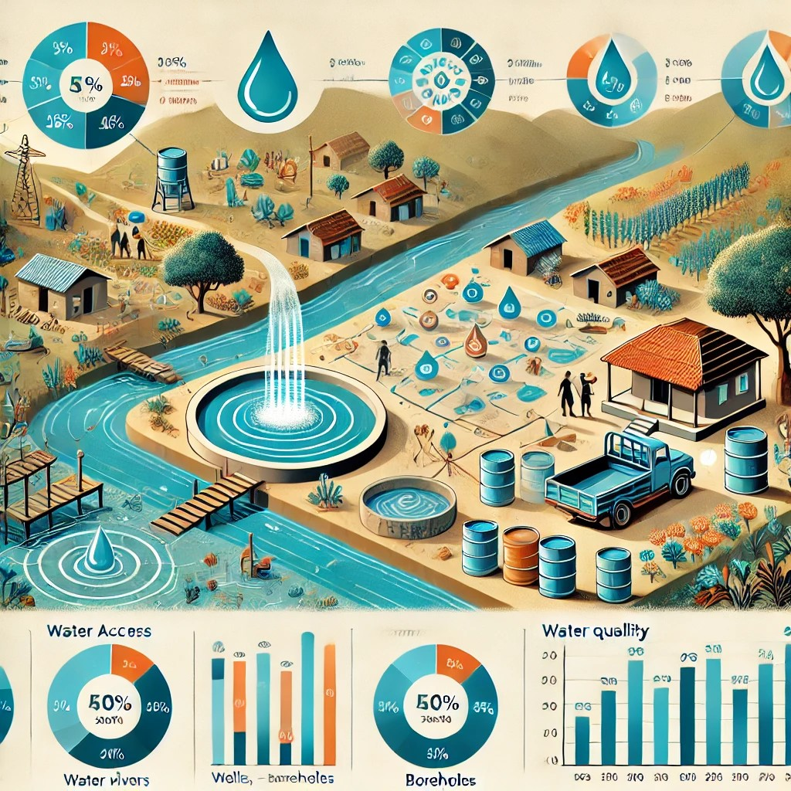

# Maji-Ndogo-Water-Access-Analysis
This project tackles critical water access challenges in Maji Ndogo. Using advanced data analysis and SQL techniques, the project identifies disparities in water accessibility, prioritizes areas for intervention, and outlines practical solutions to improve infrastructure. The repository includes structured SQL queries, data aggregation techniques, and insightful visualizations that help decision-makers drive meaningful change.
   

## Core Focus of the Analysis

1 Water Source Distribution:
- Examines the availability and types of water sources (rivers, wells, shared taps, etc.) across provinces and towns.
- Highlights areas with the largest reliance on unsafe water sources like rivers.
  Queue Times and Infrastructure Efficiency:
- Investigates the queue times at shared taps to identify overburdened locations.
- Detects disparities in wait times and inefficiencies in water infrastructure.
2 Water Quality and Contamination:
- Assesses contamination levels in wells, differentiating between chemical and biological pollutants.
- Proposes specific interventions for purifying water sources.  
3 Broken Infrastructure:
- Identifies areas where home water taps are installed but non-functional due to systemic failures in pipes, pumps, and reservoirs. 
4 Inequalities in Access:
- Uncovers disparities between rural and urban areas, highlighting inequitable distribution and access to clean water.
## Key Tasks:
- Data Integration: Used INNER JOIN and LEFT JOIN techniques to connect and preserve necessary data across tables.
- Exploratory Data Analysis: Investigated relationships between towns/provinces and water sources and Analyzed key variables such as water source type, number of people served, and queue times.
- Water Quality Assessment: Filtered and categorized wells based on contamination types (chemical vs. biological) using control logic,Identified clean wells and proposed appropriate filtration systems (e.g., UV or RO filters)
- Queue Time Analysis: Highlighted towns with excessively long queue times and proposed solutions to reduce them.
- Infrastructure Diagnosis: Identified broken in-home taps and proposed inspections for underlying issues in local water systems.
- Action Planning: Designed a Project_progress table to track water source improvements.
Populated actionable insights, including tasks like drilling wells, installing filters, or diagnosing broken infrastructure.

## Database Structure

The project uses the following tables:
- **`location`**:Contains information about the geographic locations of water sources.
- **`visits`**: Tracks survey visits to water source sites and queue-related data.
- **`well_pollution`**: Contains data on the pollution status of wells.
- **`water_source`**: Provides details about the types of water sources and the populations they serve.
- **`Project_progress`**: Designed to track progress on repairs, upgrades, and improvements for water sources.
- **`combined_analysis_table`**: Created by joining the above tables to simplify analysis and provide a comprehensive view of water access.
  
## Highlights and Impact
 Key Findings:

- 43% of citizens rely on overburdened shared taps, with queue times exceeding 120 minutes in some areas.
- 18% of the population depends on wells, of which only 28% provide clean water.
- 45% of households with in-home taps face non-functional systems.

Proposed Interventions:

- Drill wells for communities relying on unsafe sources like rivers.
- Install UV and RO filters to purify contaminated wells.
- Repair and maintain critical infrastructure to restore functionality and reduce queue times.

## How to Run the Project

1. Import the SQL files provided in the `/sql` directory.
2. Populate the database with sample data, following the instructions in `data_loading.sql`.
3. Execute the query files to generate views, track progress, and analyze data.

## Access the Full Documentation

Dataset was provided by ALX [project documentation](https://alx.com).
